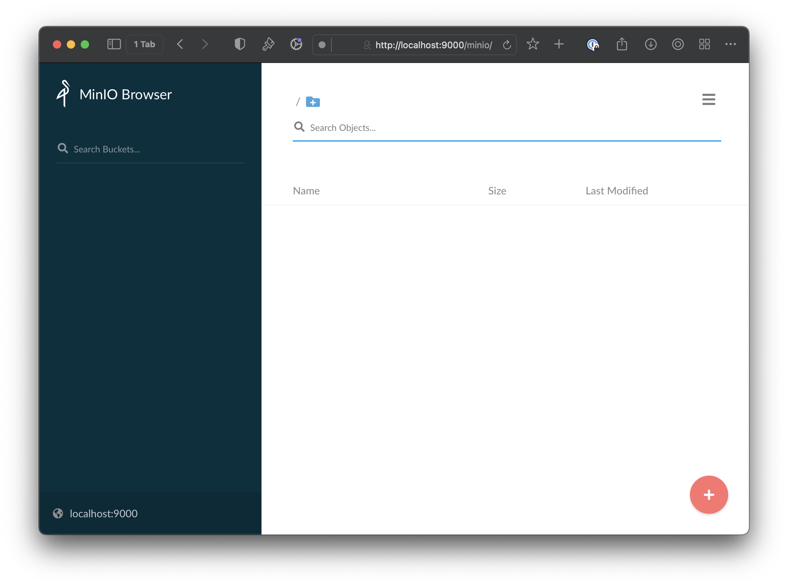
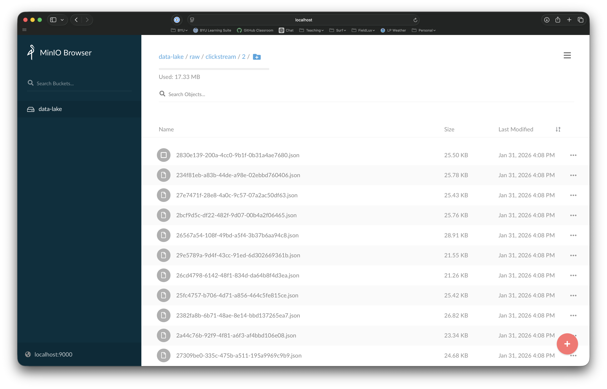
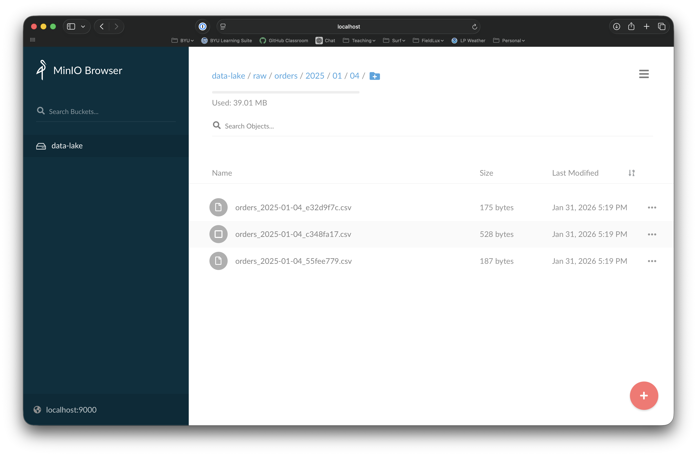
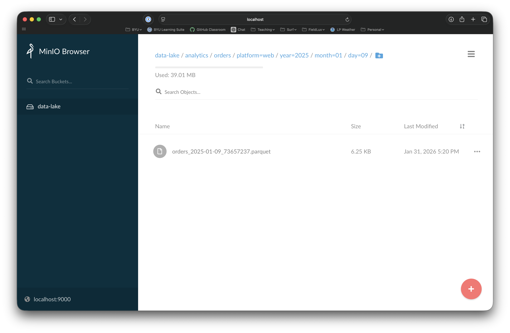
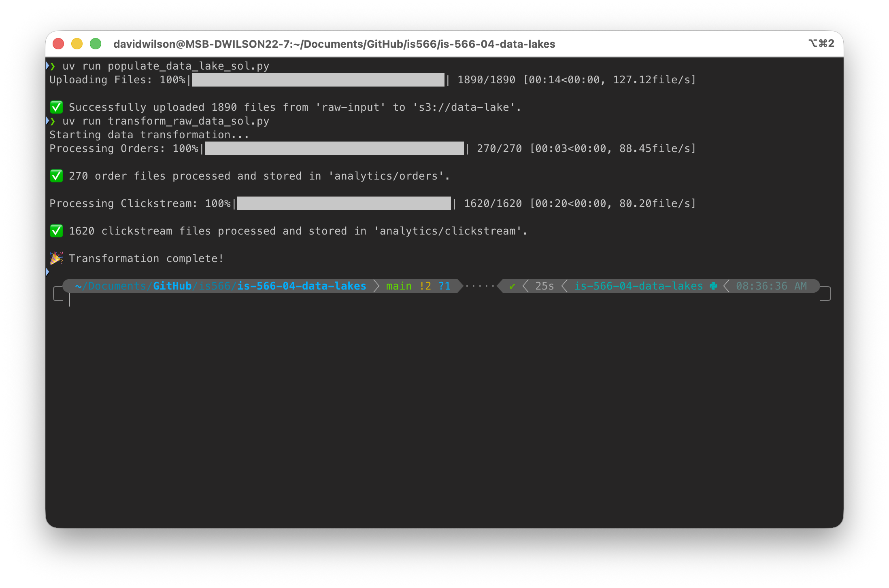
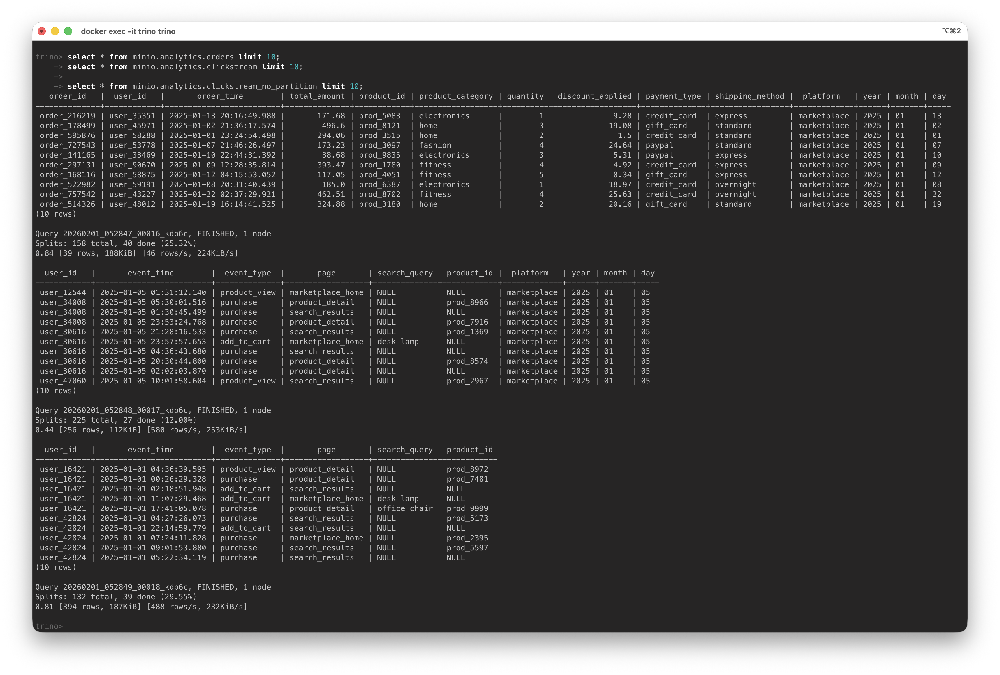
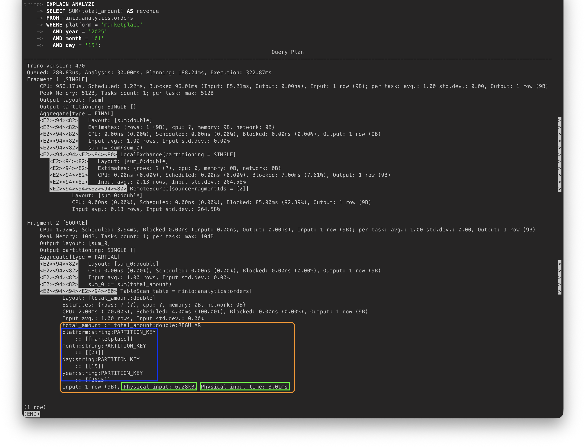
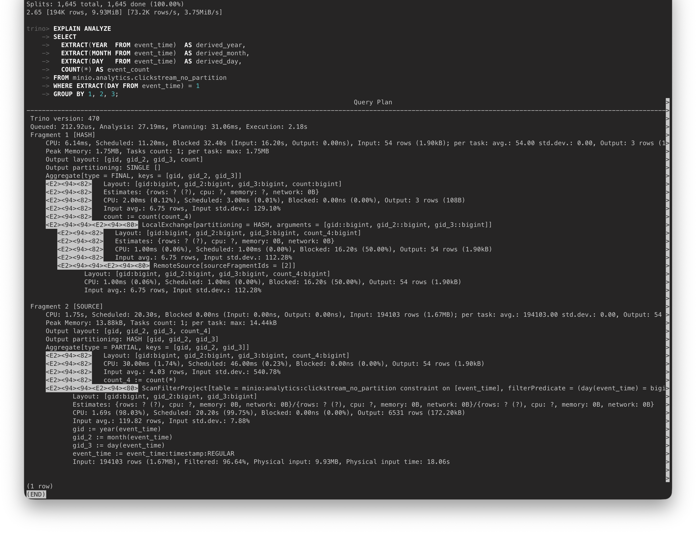

# Hands On Lab: Data Lakes

## The Use Case

You have been hired as a data consultant for an online retailer named ShopWave. ShopWave would like to analyze customer behavior to optimize their recommendation engine. Among the various systems used by the company to run the business, the two that are most relevant for this analysis task are:
1. Website Clickstream Data (JSON, semi-structured): Logs of user clicks, page views, and search queries.
2. Order Transaction Data (CSV): Sales records, including order amounts, products ordered, and payment and shipping methods.

ShopWave has exported a month's worth of data from January 2024, and has asked you to consolidate the data into a two-stage data lake. Specifically, you will first build an ingestion process to insert all of the data files into a raw staging area in the data lake, organized in a logical way but otherwise leaving the raw data files untouched so that ShopWave can adapt and expand its data strategy over time using the same raw data starting point.

Next, you'll be drafting a transformation process that will do some (very) light cleaning and then store the cleaned data in parquet files that are ready for analysis. These parquet files will be stored in their own analytics layer in the data lake, using a schema that will scale with the business as it grows.

Lastly, you'll configure a flexible query tool that will support efficient ad hoc queries to be executed across the parquet files stored in the analytics layer. This query tool will depend on carefully partitioned data to allow for fast query performance even as the size of the data lake grows over time.

Right now, you're probably thinking to yourself "WOW! This sounds like a lot of fun. And I bet a future employer would really like to hire someone who has the type of skillset I'm going to develop during this assignment." Well...you're right on both counts. 

So let's hone some skills, mmmkay?

---

## Task 1: Get your Environment Up and Running

First, let's do some quick setup tasks:
1. Create a python virtual environment in the project folder for this assignment. (I used python 3.12, in case you care.) I've included a `pyproject.toml` file in the repository that will make it easy for you.
2. Unzip the _contents_ of the `raw-inputs.zip` file to a folder called `raw-inputs` in this directory. Note for Windows Users: when you unzip things, the contents are often nested one level deeper than intended. You'll want to ensure that you now have a bunch of files just one level in, e.g., `raw-inputs/00a22f72-0516-48d5-a6f5-5529e25b61b9.json`
3. We'll be using Docker rather extensively for this assignment, but you won't have to build any of your own images. Instead, you can navigate down into the `aqua-node` directory (which is the docker compose environment that will house all of the server environment) and have a look at the `docker-compose.yml` found there. Here's a quick description of the services you see there:
    - `minio`: MinIO is basically a "Local and Free Amazon S3", designed as a tool that developers can use to test s3-like functionality within a container environment without having to worry about managing permissions (or paying) for S3 on AWS. Note that (a) there are environment variables that set the access and security keys to "minio_access_key" and "minio_secret_key", respectively, and (b) the volume mapping will present the `minio` directory to the container as `/data` (which I've done intentionally right here in the repo so that you can see how MinIO will store the objects we insert into the data lake).
    - `trino`: Trino (formerly, PrestoSQL) is an open source query engine that is designed to work with data lakes as a "SQL-on-lake" tool similar to Amazon's Athena query tool. It's a fairly powerful query tool that scales incredibly well on even massive datasets. Our sample dataset is small, but we'll be setting up our data lake as if it were massive in scale so that you can see a few associated strategies and have that much more exposure to real-world data scenarios. 
    - `hive-metastore`: Apache Hive is a distributed data storage system that has been around for a long time. One of its core components is the "Hive Metastore", which maintains some helpful metadata about how the data is distributed and partitioned across the data lake. Trino (and other tools like Apache Spark) use the Hive Metastore to know how to traverse a very large dataset efficiently and assemble query results into a sensible table-like result set.
    - `mariadb`: This is essentially a MySQL database that Trino uses to keep track of some additional Trino-specific metadata. (The details aren't especially important.)
4. Now you can use `docker compose up -d` to launch the 4 services explained above. The first launch will take a while because there are several gigabytes' worth of images to pull down. Once everything is pulled down, the docker environment should spin up without requiring any edits or troubleshooting from you. (You're welcome!)
5. Just to verify that everything is working as intended, you can navigate to the MinIO interface in your browser (localhost:9000), where you can use the `MINIO_ACCESS_KEY` and `MINIO_SECRET_KEY` configured in the compose file to log in. If all is as expected, you'll see an interface that looks like the image below: 



> [!IMPORTANT]
> 📷 Before continuing on, take a screenshot of your own MinIO interface similar to mine above. Save this screenshot as `task_1.png` (or jpg) to the `screenshots` folder in the assignment repository.

---

## Task 2: Ingest Data into the Data Lake

Your first real task is to create a routine to ingest the data files (which you can unzip into a `raw-input` folder) into the data lake. You'll need to figure out the best way to work with the files in `raw-input` to organize the raw data layer of the data lake into the hierarchy depicted in the structure below. (Note that this task only involves the `/raw/` area of the data lake; the `/analytics/` area will be populated in a later task.) Pay careful attention to what is defining the partition structure in each of the subfolders.

```swift
/data-lake/
  /raw/
      /clickstream/
        /0/
          0760cf24-ee24-11ef-a007-2a3defae9fdd.json
          02948784-ee23-11ef-a007-2a3defae9fdd.json
          ...
        /1/
          14e89308-ee23-11ef-a007-2a3defae9fdd.json
          157058e2-ee23-11ef-a007-2a3defae9fdd.json
          ...
        ...
      /orders/
        /2025/
          /01/
            /01/
              orders_2025-01-01_530a28a4.csv
              orders_2025-01-01_79e3587d.csv
              ...
            /02/
              orders_2025-01-02_626d686e.csv
              orders_2025-01-02_967c2928.csv
              ...
            ...
  /analytics/
    /clickstream/
      /platform=web/
        /year=2025/
          /month=01/
            /day=01/
              2e2add90-ee22-11ef-a007-2a3defae9fdd.parquet
              ...
    /orders/
      /platform=web/
        /year=2025/
          /month=01/
            /day=01/
              orders_2024-01-01_79e3587d.parquet
              ...
```


To do this, you'll need to edit the `populate_data_lake.py` script that I've started for you. You'll find that I've drafted much of logical flow of the ingestion process, with comments that point out where you'll need to add code to get the data into the data lake in the desired hierarchy.

Note that you don't need to write this code from scratch. I'd encourage you to practice using ChatGPT to accomplish very targeted coding tasks, with careful instructions in which you specify the exact coding logic that you're looking to add, and then fully understanding how the code that you get back implements the desired logic.

> [!IMPORTANT]
> Note that you could probably paste in these instructions and the code skeleton files to ChatGPT and likely get a working solution with very little effort, and I can't stop you from doing that. But I would suggest that your learning would be better served by working through the logic yourself and just asking ChatGPT for help implementing what you've already decided to implement. Practice using ChatGPT in a way that you'd feel comfortable defending to a future boss someday.

Following the comments I've left in the `populate_data_lake.py` file, get the script working and populating the data in the "raw" area of the data lake. As you write your code, you can test it by running your python script (using the virtual environment). (**Pro tip**: the python debugger with breakpoints set will be your best friend here!) If your script runs without errors, you'll see a "Successfully uploaded files" message displayed in the console. More importantly, though, you'll be able to see your files displayed in the browser interface for MinIO. If everything worked as expected, you should see something similar to the screenshots below when you navigate all the way down to one of the json and then one of the csv files. (See my suggestions below the image for some tips on troubleshooting.)





**If you have a bug in your code**, it's possible that at least some files will have been inserted in the wrong locations. If this happens, you may need to fight with MinIO to get those files deleted. (You can delete them one by one, but that's tedious, and MinIO will prevent you from deleting any folder that isn't empty.) So if you need to get rid of some faulty files in the data lake, the easiest way is to just get rid of the whole data lake and then re-run the ingestion script. To do this, you can (1) shut down the compose environment and blow away the metadata with `docker compose down -v`, and (2) delete the `aqua-node/minio/.minio.sys` and `aqua-node/minio/data-lake` folders that get added by MinIO when you start inserting files. Doing both of these things will give you a clean slate before running the populate script again.

Note also that you will never duplicate any data in MinIO if you insert it into the same location. So you can re-run the ingestion script even if some of the files are still in the data lake (as long as you're inserting them into the same place with the same name, etc.). 

> [!IMPORTANT]
> 📷 Before continuing on, take two screenshots of your own MinIO interface similar to mine above. Save these screenshots as `task_2_json.png` and `task_2_csv.png` to the `screenshots` folder in the assignment repository.

---

## Task 3: Transform Data in the Data Lake

The next task is to do some processing of the raw files you now have in the data lake. The goal of this process is to get the data arranged and formatted in a way that is compatible with the SQL-on-lake query tool we'll be using (Trino). As I found through many hours of trial and error while preparing this assignment, Trino is _very_ particular about the way a data lake needs to be organized in order to work properly. Luckily, you don't have to figure this out on your own. The required structure is summarized in the data lake hierarchy found at the beginning of Task 2 above.

Your job is to figure out the logic to read the raw data from its new home in the data lake, convert the data into a pandas dataframe, then use the `to_parquet()` function to export the data as a parquet file. Those parquet files will then need to be inserted into the hierarchy depicted for the analytics layer of the data lake. 

> [!TIP]
> As you read the data from the `/raw/` area of the data lake, make sure that you properly format the `order_time` and `event_time` columns in the orders and clickstream dataframes, respectively, before placing them in the `/analytics/` area. You'll want these to be treated as datetime fields later when we're using Trino to query the data lake.

The `transform_raw_data.py` script again has a large portion of the logic already drafted for you, though there are more holes in this one where you'll be asked to come up with the logic that will get the job done. Again, you're welcome to use ChatGPT to help with some syntax, etc., but I'll encourage you to do the logic work on your own. 

As you get the script working, you can again test it by running your python script (using the virtual environment). You'll see similar progress bars and "success" messages in the console, and you can check your work in the MinIO browser interface to make sure that you're getting the hierarchy right. If everything worked as expected, you should see something similar to the screenshot below when you navigate all the way down to one of the orders parquet files. 



> [!IMPORTANT]
> 📷 Before continuing on, take a screenshot of your own MinIO interface similar to mine above. Save this screenshot as `task_3.png` (or jpg) to the `screenshots` folder in the assignment repository.

---

## Task 4: Insert Data for all of Q1 2025

The data provided for testing in `raw-input` contained the simulated export data for just the month of January. But to fully enjoy (?) the SQL-on-lake queries we'll be running with Trino in the next section, it would be better to have a bit more data. 

I've prepared the files for the rest of the Q1 of 2025 as a zip file that is slightly too large to include in the GitHub repository. So you can download it from [this link](https://www.dropbox.com/scl/fi/uim8m2fx8zac04tcac66k/more-data.zip?rlkey=2errdsurcxn5awyu6lzgvjjy5&dl=1). Unzip that file to anywhere you'd like, and then you can move all of the json and csv files from there into the `raw-input` folder. After doing so, you'll be able to re-run your two python scripts, this time with many more data files. After doing so, you should see output close to what you see in the image below.



> [!IMPORTANT]
> 📷 Before continuing on, take a screenshot of your own terminal window showing that you've successfully added and transformed lots more files. Save this screenshot as `task_4.png` (or jpg) to the `screenshots` folder in the assignment repository.

---

## Task 5: Configure the Trino Query Engine

Now we get to the fun part! Now that we have a data lake with properly organized parquet files, we can use those performance-optimized files to run our own scalable SQL-on-lake query engine. The Trino server that has been running since you completed Task 1 is based on the same core technology as any of the big query engines on modern warehouse platforms. When we run a query, it's going to use some metadata to understand where it needs to go looking for the results that fit the criteria of the query. Because of how the analytics layer in our data lake is organized, Trino can use the partitions we've provided to know which branch(es) of the directory tree to go searching through. 

For example, if we ran a query to summarize the search terms related to a specific product that originated from our mobile traffic during the last 3 days in January, the SQL would look something like:

```SQL
select 
  search_query, 
  product_id 
from clickstream 
where 
  search_query is not null and 
  product_id = 'prod_9172' and
  platform = 'mobile' and 
  day in ('29','30','31') 
```

With the query above, Trino will make use of the partitions embedded in the folder structure to search through mobile traffic (`platform=mobile`), and only the last three days of January (`day=29`, `day=30`, and `day=31`), ignoring the data in any of the many other subfolders in the `analytics/clickstream` data. Pretty cool!

### 5.1 - Configure the Trino Query Engine

Trino needs to be configured very carefully to enable this behavior, and I'm going to walk you through it:
1. First, have a look at the properties file located at `aqua-node/conf/etc/catalog/minio.properties`. You don't need to change anything in this file, but you can see that there are two groups of settings that I've provided for you. The first group configures the hive backend, which is the service that performs distributed scans of the directory structure. The second group provides the settings for s3 (for which MinIO stands in as a local replacement within the docker environment).
2. Next, we're going to connect into the Trino server in our docker environment so that we can run some SQL commands to set up the query engine and the partition settings. Start by running the `trino` command against the `trino` container. (Remember how to execute commands on a particular docker container? I just _knew_ you would.) 
3. If you do the previous item correctly, you'll end up with a `trino >` prompt in your terminal, which is how we can run SQL commands. To test that you are, in fact, able to run SQL commands on the Trino, you can execute the command `show catalogs;`, which will return a 2-row result, one of which should be `minio`. (This catalog is the one configured in the `minio.properties` file we were looking at earlier.)
4. Next, we're going to create a schema and three tables within the Trino environment. You'll find the commands you need to run in the `trino_init.sql` file in the repository. The first statement in that file will create the schema. Then there are three table creation commands for the `orders`, `clickstream`, and `clickstream_no_partition` tables. Pay particular attention to the `WITH` clauses in the first two. This is where the file format of the underlying data is defined (which for us is parquet), and it's where we inform Trino about how the partitions will work (in the `partitioned_by` parameter). The third table purposefully has no partitions defined so that we can explore the effect of running some queries with and without partitioning in the next task. Run all three `CREATE` statements. (Note that we don't actually insert any data; the data is already there in our data lake and we just need to tell Trino how it's arranged.)
5. Next, we need to execute the two `CALL` commands, which will run the `sync_partition_metadata()` function for the two tables with partitions defined. This function is how you tell Trino to go look at the partition structures in the data lake so that it knows which partitions exist and what the possible values of those partitions are. Running these two commands will update those partition details, once for each table.
6. With the tables created and configured to read from the data lake, and the partitions updated, you can now use the final three commands to ensure that everything is working. If you see results like those in my screenshot below, then you have everything setup properly.

(If instead you are getting some errors about formatting or datatypes, etc., this probably means that you need to add some data cleaning or formatting to your pandas dataframes in the transformation script prior to the dataframes being converted to parquet files and placed in the analytics layer in the data lake. Don't give up here! You're almost there.)



> [!IMPORTANT]
> 📷 Before continuing on, take a screenshot of your own terminal window showing that you've successfully run the three sample queries. Save this screenshot as `task_5.1.png` (or jpg) to the `screenshots` folder in the assignment repository.

---

### Task 5.2 - Explore the Data a Bit

Before we wrap up, we're going to gain some experience with how partitions work. I have two sets of queries for you to run to get a sense for how partitions can really speed up analytical operations. Each of these uses the `EXPLAIN ANALYZE` command before a `SELECT` statement, which will ask the query engine to report a bunch of metadata about how long each query took to run and how much data had to be scanned to bring back the results of the query. There is a LOT of output, and you don't need to understand it all. In each case, you'll see output like the example below. You can look for the portion near the bottom (in orange) that shows how many partitions the query scanned (in blue), as well as the amount of data scanned and the time it took to scan (in green).



> [!TIP]
> When you run a query via the `trino >` command line, any time the results will be longer than your terminal window, you'll be pulled into a viewer that will capture your terminal. When this happens, you can use the `<Space Bar>` to scroll downward, and you can press `q` to quit and get back to the trino command prompt.

Okay let's run two sets of queries to look at our analytical data. The first pair of queries will obtain the total revenue over different time spans. The first should run faster than the second. Why is this?. Pay attention to how many partitions are shown in the first vs. the second. More importantly, look at the time difference between the two. (The second should be at least 20-30 times faster than the first.) 

#### Comparison Query 1

```SQL
-- Faster Query, scans just one day
EXPLAIN ANALYZE
SELECT SUM(total_amount) AS revenue
FROM minio.analytics.orders
WHERE platform = 'marketplace'
  AND year = '2025'
  AND month = '01'
  AND day = '15';

-- Slower Query, scans all of January
EXPLAIN ANALYZE
SELECT SUM(total_amount) AS revenue
FROM minio.analytics.orders
WHERE platform = 'marketplace'
  AND year = '2025'
  AND month = '01';
```

The reason for the performance difference is pretty simple: summing the revenue over January takes longer than summing the revenue from a single day. But now let's look at two queries that are identical except that one makes use of our nice partitions while the other does not. 

#### Comparison Query 2

```SQL
-- Faster Query, makes use of partitioning
EXPLAIN ANALYZE
SELECT
  year,
  month,
  day,
  COUNT(*) AS event_count
FROM minio.analytics.clickstream
WHERE day = '01'
GROUP BY 1, 2, 3;

-- Slower Query, no partitioning available
EXPLAIN ANALYZE
SELECT
  EXTRACT(YEAR  FROM event_time)  AS derived_year,
  EXTRACT(MONTH FROM event_time)  AS derived_month,
  EXTRACT(DAY   FROM event_time)  AS derived_day,
  COUNT(*) AS event_count
FROM minio.analytics.clickstream_no_partition
WHERE EXTRACT(DAY FROM event_time) = 1
GROUP BY 1, 2, 3;
```

Both queries are counting clickstream events on the first day of every month. (I know...that's a pretty contrived scenario, but it's 11pm and I can't think of anything more creative.) The key difference between the two queries is that one queries the `clickstream` table that has our dedicated partition keys (`year`, `month`, `day`) to do the grouping and filtering, while the other queries the `clickstream_no_partition` table that has no partitions. To make the queries comparable, I had the second one manually derive the date information from the `event_time` column to accomplish the same grouping and filtering. Again, if you examine the "Physical input time" values from each query analysis, you'll likely see about a 30x difference in speed.

If everything is working properly, that last `EXPLAIN ANALYZE` command will leave your terminal looking something like the example image below.



> [!IMPORTANT]
> 📷 Before finishing, take a screenshot of your own terminal window showing that you've successfully run the query analysis like mine above. Save this screenshot as `task_5.2.png` (or jpg) to the `screenshots` folder in the assignment repository.

---

### Save, Commit, and Push Changes

**Note that there is no separate rubric nor a google form associated with your submission.** You should, however, verify that you have the following screenshots saved to the `screenshots` directory before you push your changes:
- task_1.png
- task_2_json.png
- task_2_csv.png
- task_3.png
- task_4.png
- task_5.1.png
- task_5.2.png
